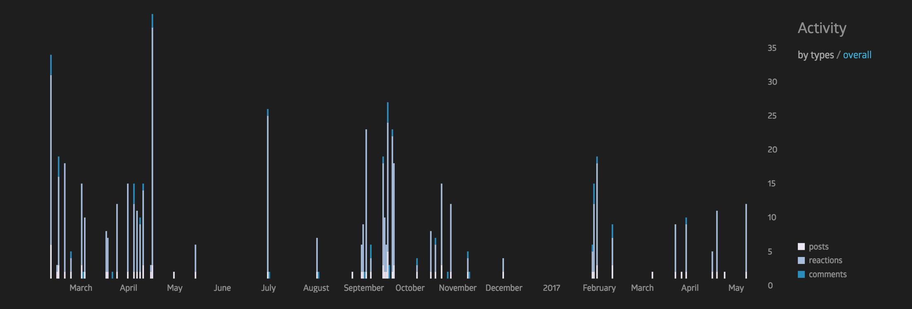

## Summary of the Community's Needs

[Freetail Hackers](https://freetailhackers.com/) is a large and wide spread community that encompasses a lot of different sub groups. At 631 online members it is already a large community. We organize workshops, meetups, and hackathons for the student community at the **University of Texas at Austin**. We facilitate most of our community wide communication through online channels just as mailing lists or [facebook groups](https://www.facebook.com/groups/freetail/). Because of this, the culture within the group is not as close knit as I would like it to be. We are an extremely open community the reaches out to a lot of parts of campus to find people interested in hacker culture but I think we don't do enough to bring them together afterward. I feel like we need to do more to develop conversations that people have at our in person events and meetups and continue them outside of the planned spaces. Community engagement drops off significantly right after we have a meetup and I feel like we need to do something about it.

Some statistics for throughout the history of the facebook group:
- **67 posts**
- **23 authors**
- **29 commenters**
- **155 reactors**

Looking at the history of posts on the FB group we see that things drastically die down during break periods and when we don't have planned events. While this pattern is expected, I believe that effects this drastic show an underlying issue in the way we run the group.

My proposal for bringing the Freetail Hackers community closer together centers around bringing more **social events** to the group. I think one of the biggest reasons that things tend to die out and not become more personal at our events is that they are not a conducive social atmosphere. Hackathons are great for meeting other individuals if they are of a more casual nature. But if there are big prizes on the line or if they have a strongly competitive atmosphere to them, it becomes difficult to socialize with hackers from other teams.

In addition, workshops are a great format for learning about new things and getting hands on experience with a mentor nearby. But again, it doesn't facilitate meaningful discussions between attendees of the event.

## Your Proposal

#### Plan of Attack

Since *bringing more social events to the community*  is the overall goal, I see a few different styles of event to have.

1. **Texas Traveling Hacker Meetups**
2. **Develop the Freetail Hacker Identity**

___

#### Texas Traveling Hacker Meetups

Most hackathons in Texas have a great relationship with each and send buses to other schools to bring hackers over to their own events. Since we are one of the largest universities in the state and have a pretty active traveling hacker community we are very lucky to almost always have at least one bus stop by our campus. I think it would be great if we could get all UT hackers that will be traveling to various other Texas hackathons to meet up around a week before the event to get to know other students that will be traveling with them whether on the bus or otherwise. This accomplish a few goals:

- natural team formation
- cross team communication
- ideation
- community development through a more casual environment

I think this would be a great way to accomplish all of these things.

In this section, articulate the project you want to accomplish during the Campus Experts program; provide a brief summary of what you are planning to accomplish with your project.

The following pieces might help strengthen this section:
- **Timing**: For most of you, it'll be nearing summer as you finish the training. This means exams, end of semester, and students disappearing to go on internships. This means it might be best to consider an event that happens after you return in the new semester: think about the impact that the new students will have on the event, and what the effect of students graduating will be.
- **Community demographics**: If you are planning on increasing the size of the community, identify ways you are planning on accomplishing that. Explain how your efforts might help you create a more diverse community.
- **Goals**: You identified the goals of your community assessment. Include a summary of those goals and how your proposal addresses those goals.
- **Communication**: For a community to thrive, they need to be able to communicate with each other, identify how your community will be able to stay in-contact. This includes in-person meetings, webinars, and chat/forum platforms.

## Your Proposal's Impact

In this section, analyze your community's needs against what your proposal aims to accomplish.
Itemize each of the needs you hope to address with your proposal and indicate whether each of these needs are within the scope of your proposal.

When identifying the impact of your proposal, you should focus on the following areas:
- Target audience
  - Who are you expecting to impact based on your proposal?
- Community needs
  - What specific issue are you addressing with your proposal?
- Resources
  - What resources do you need to accomplish your proposal?
  - How will you obtain those resources?   
- Media
  - How are you preparing to deliver your community impact project?
  - What are you going to do to prepare to deliver the content?
- Content knowledge
  - How knowledgeable are you on about the topic your community impact project focuses on?
  - What resources do you have at your disposal to enhance that knowledge?
- Timeline
  - Develop a rough timeline for your community impact project.
  - If you are presenting content, identify the timing of your presentation.

## Planning for the Future

In this section, think about how your efforts can expand beyond this 8-week program. Some questions you can answer that might help strengthen this section are:

- When will you review the impact of your proposal?
- How will you measure success?
- How frequently will you iterate on your community plans?
